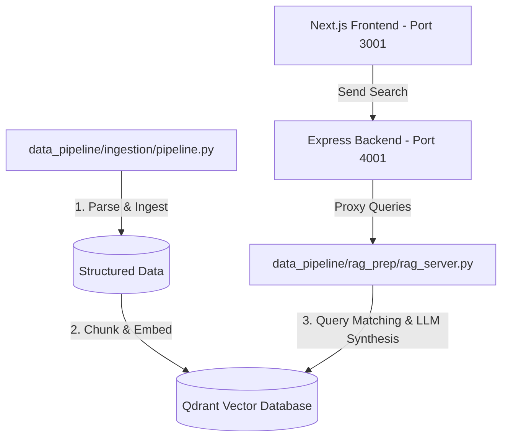

# Vidhi-Ai: Nepalese Legal RAG & Citations Explorer

Vidhi-Ai is a production-grade legal query assistant that processes and indexes Nepalese acts (including the Constitution of Nepal) to provide precise responses with article/clause-level citations.

---

## System Architecture Overview



---

## Setup & Execution Guide

Follow the steps below in sequence to ingest the data and run the applications.

### Prerequisites
- **Python**: v3.10 or higher
- **Node.js**: v22 or higher
- **Credentials**: Qdrant Cloud URL/API Key, Google Gemini API Key

---

### Step 1: Environment Variables Setup

Ensure you have `.env` files created in the respective workspace directories.

#### 1. Data Pipeline (`data_pipeline/.env`)
Create `data_pipeline/.env` with your Qdrant and Google credentials:
```env
QDRANT_URL=https://your-qdrant-cluster.io:6333
QDRANT_API_KEY=your-api-key

GEMINI_API_KEY=your-gemini-key
GOOGLE_API_KEY=your-gemini-key
GOOGLE_PROJECT_ID=your-project-id
```

#### 2. Express Backend (`backend/.env`)
Create `backend/.env` with the URL of the Python RAG server (running on port `5001` by default):
```env
PYTHON_RAG_URL=http://127.0.0.1:5001/query
PORT=4001
```

#### 3. Frontend App (`frontend/.env.local`)
Create `frontend/.env.local` to point Next.js to the Express server port:
```env
NEXT_PUBLIC_API_URL=http://localhost:4001
```

---

### Step 2: Data Ingestion & Indexing
Run the pipeline script to fetch, clean, chunk, embed, and upload the legal acts to your Qdrant cluster.

1. Navigate to the `data_pipeline` directory:
   ```bash
   cd data_pipeline
   ```
2. Install Python dependencies:
   ```bash
   pip install -r requirements.txt
   ```
3. Execute the ingestion pipeline script:
   ```bash
   python3 ingestion/pipeline.py
   ```

---

### Step 3: Run the Python RAG Microservice
Start the persistent Python RAG server that receives queries, fetches corresponding vector chunks from Qdrant, and interfaces with the Gemini model to synthesize legal responses.

1. Navigate to the `data_pipeline` directory (if not already there):
   ```bash
   cd data_pipeline
   ```
2. Start the server (runs on port `5001`):
   ```bash
   python3 rag_prep/rag_server.py
   ```

---

### Step 4: Start the Express Backend Server
The Express server acts as a secure proxy API communicating directly with the Python RAG microservice.

1. Navigate to the `backend` directory:
   ```bash
   cd ../backend
   ```
2. Install Node.js packages:
   ```bash
   npm install
   ```
3. Run the development server (runs on port `4001`):
   ```bash
   npm run dev
   ```

---

### Step 5: Start the Next.js Frontend
The frontend provides a clean, minimalist Retro UI (Neo-brutalist theme) search engine layout with full citation highlighting.

1. Navigate to the `frontend` directory:
   ```bash
   cd ../frontend
   ```
2. Install Node.js packages:
   ```bash
   npm install
   ```
3. Start the Next.js development server (runs on port `3001`):
   ```bash
   npm run dev
   ```

Open **[http://localhost:3001](http://localhost:3001)** in your browser to start querying the indexed Nepalese laws!
